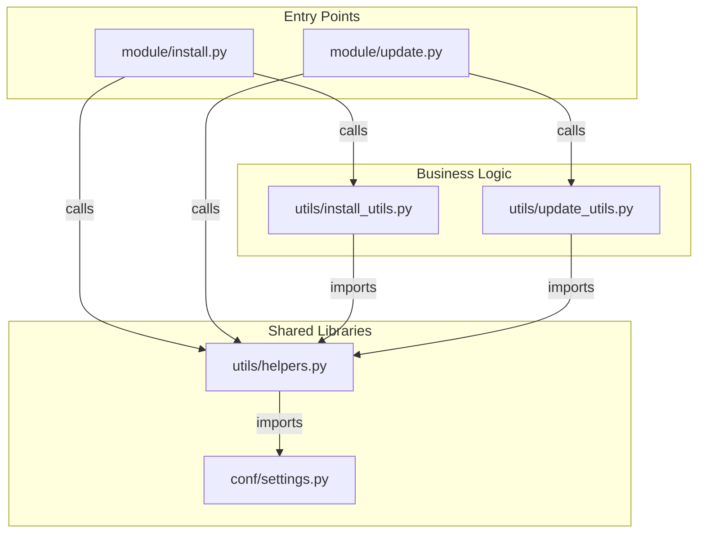

# Developer Guide

This document outlines the project's internal structure and module relationships to aid in future development.

## Project Structure

The project is organized into the following main directories:

- `module/`: Contains the main entry point scripts (`install.py`, `update.py`).
- `utils/`: Contains helper functions.
  - `helpers.py`: Low-level, shared utility functions (e.g., system commands, file operations).
  - `install_utils.py`: High-level functions specific to the installation process.
  - `update_utils.py`: High-level functions specific to the update process.
- `conf/`: Contains static configuration files.
  - `settings.py`: Shared settings like remote repository URLs.

## Module Relationship Diagram

The following diagram illustrates how the different modules import and depend on each other.

