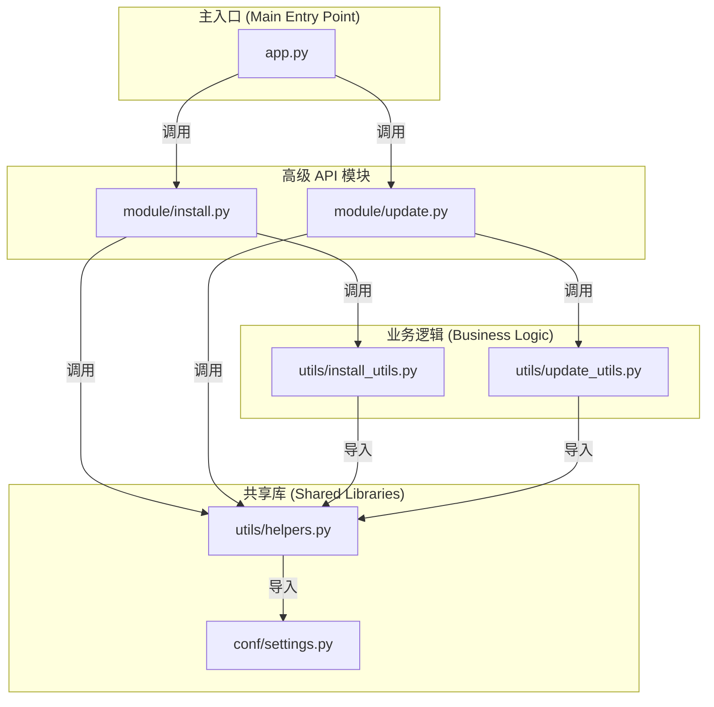

# 开发者指南

本文档概述了项目的内部结构和模块关系，以帮助未来开发。

## 项目结构

项目被组织为以下几个主要目录：

- `app.py`: 项目的统一命令行入口，负责调度安装和更新任务。
- `module/`: 封装了核心功能的模块，可被外部调用。
  - `install.py`: 提供 `install_agent` 函数。
  - `update.py`: 提供 `update_agent` 函数。
- `utils/`: 存放辅助函数。
  - `helpers.py`: 底层的、跨模块共享的工具函数（如系统命令、文件操作）。
  - `install_utils.py`: 服务于安装流程的高级函数。
  - `update_utils.py`: 服务于更新流程的高级函数。
- `conf/`: 存放静态配置文件。
  - `settings.py`: 共享的配置，如远程仓库 URL。

## 模块关系图

下图展示了不同模块之间的导入和依赖关系。

