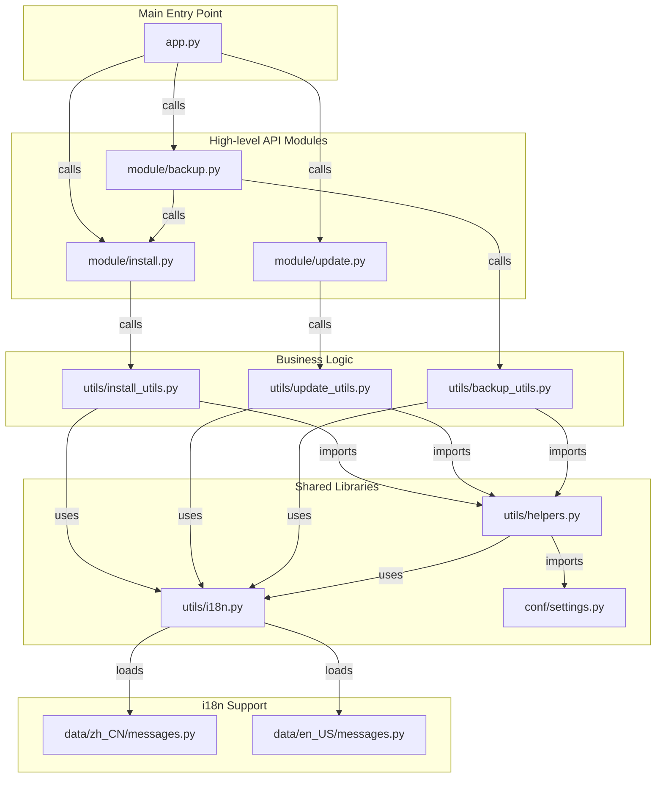

[以中文阅读](./DEVELOP.md)

# Developer Guide

This document outlines the project's internal structure and module relationships to aid in future development.

## Project Structure

The project is organized into the following main directories:

- `app.py`: The unified command-line entry point for the project, responsible for dispatching installation, update, and backup/recovery tasks.
- `module/`: Modules that encapsulate core features and can be called externally.
  - `install.py`: Provides the `install_agent` function.
  - `update.py`: Provides the `update_agent` function.
  - `backup.py`: Provides `backup_agent`, `recover_agent`, and `recover_and_install_agent` functions.
- `utils/`: Contains helper functions.
  - `helpers.py`: Low-level, shared utility functions (e.g., system commands, file operations, runtime environment detection, version information).
  - `install_utils.py`: High-level functions for the installation process.
  - `update_utils.py`: High-level functions for the update process.
  - `backup_utils.py`: Low-level functions for backup/recovery (e.g., archiving, extraction, analysis, cross-platform Docker volume operations).
  - `i18n.py`: Multi-language support management module.
- `conf/`: Contains static configuration files.
  - `settings.py`: Shared settings, such as remote repository URLs.
- `data/`: Contains multi-language files.
  - `zh_CN/messages.py`: Chinese language pack.
  - `en_US/messages.py`: English language pack.

## Module Relationship Diagram

The following diagram illustrates how the different modules import and depend on each other.



## Core Feature Modules

### Runtime Environment Detection

The project implements intelligent runtime environment detection:

- `is_running_from_source()`: Detects if running from source code
- `get_command_prefix()`: Returns the correct command prefix based on environment
- `get_version_info()`: Gets version information (source SHA or package version)

Detection mechanism considers multiple factors:
- Command name checking (`nekro-agent-toolkit` vs `app.py`)
- Script path analysis (whether in installation directory)
- Source file existence checking
- Current working directory analysis

### Cross-Platform Backup System

The project implements a cross-platform Docker volume backup solution:

#### Linux System Strategy
- Direct access to Docker volume mount point paths
- Use standard filesystem operations for backup and restore

#### macOS/Windows System Strategy
- Execute backup operations through Docker containers
- Use `docker run` commands to create temporary containers
- Execute `tar` commands on volume data within containers

#### Intelligent Volume Management
- Automatically detect if Docker volumes exist
- Automatically create missing volumes in new environments
- Support for `nekro_postgres_data` and `nekro_qdrant_data` volumes

#### Error Handling Optimization
- Distinguish between normal tar warnings and actual errors
- Intelligently handle "Removing leading `/' from member names" warnings
- Validate backup file integrity
- Smart filtering of unnecessary files (logs, uploads, .env.example, ._ prefixed files)

### Multi-language Support System

The project implements a complete multi-language support system:

#### Core Components
- `utils/i18n.py`: Multi-language management module
- `data/zh_CN/messages.py`: Chinese language pack
- `data/en_US/messages.py`: English language pack

#### Features
- Automatic language detection (based on `$LANG` environment variable)
- Dynamic language switching support
- Message parameter formatting
- Error-tolerant handling

#### Usage
```python
from utils.i18n import get_message as _

# Simple message
print(_('checking_dependencies'))

# Message with parameters
print(_('error_directory_not_exist', '/path/to/dir'))
```

## Development Workflow

### Adding New Features

1. **Analyze Requirements**: Determine which module layer the feature belongs to
2. **Design Interface**: Define function interfaces in the appropriate module
3. **Implement Logic**: Implement low-level logic in `utils/`
4. **Integration Testing**: Ensure cross-platform compatibility
5. **Update Documentation**: Update user documentation and developer documentation

### Cross-Platform Development Best Practices

1. **OS Detection**: Use `platform.system()` to detect system type
2. **Path Handling**: Use `os.path` instead of hardcoded path separators
3. **Command Execution**: Use `subprocess.run()` and properly handle return codes
4. **Error Handling**: Distinguish between system-related errors and application logic errors
5. **Testing Validation**: Test functionality on multiple operating systems

### Backup System Extension

To add support for new Docker volume backups:

1. Add volume name to `DOCKER_VOLUMES_TO_BACKUP` in `module/backup.py`
2. Ensure logic in `utils/backup_utils.py` can handle the new volume
3. Test backup and restore functionality on different operating systems

### Version Management

The project supports two types of version information:
- **Development Version**: Based on Git commit SHA
- **Release Version**: Based on version number in setup.py/pyproject.toml

Version information retrieval logic is located in the `get_version_info()` function in `utils/helpers.py`.