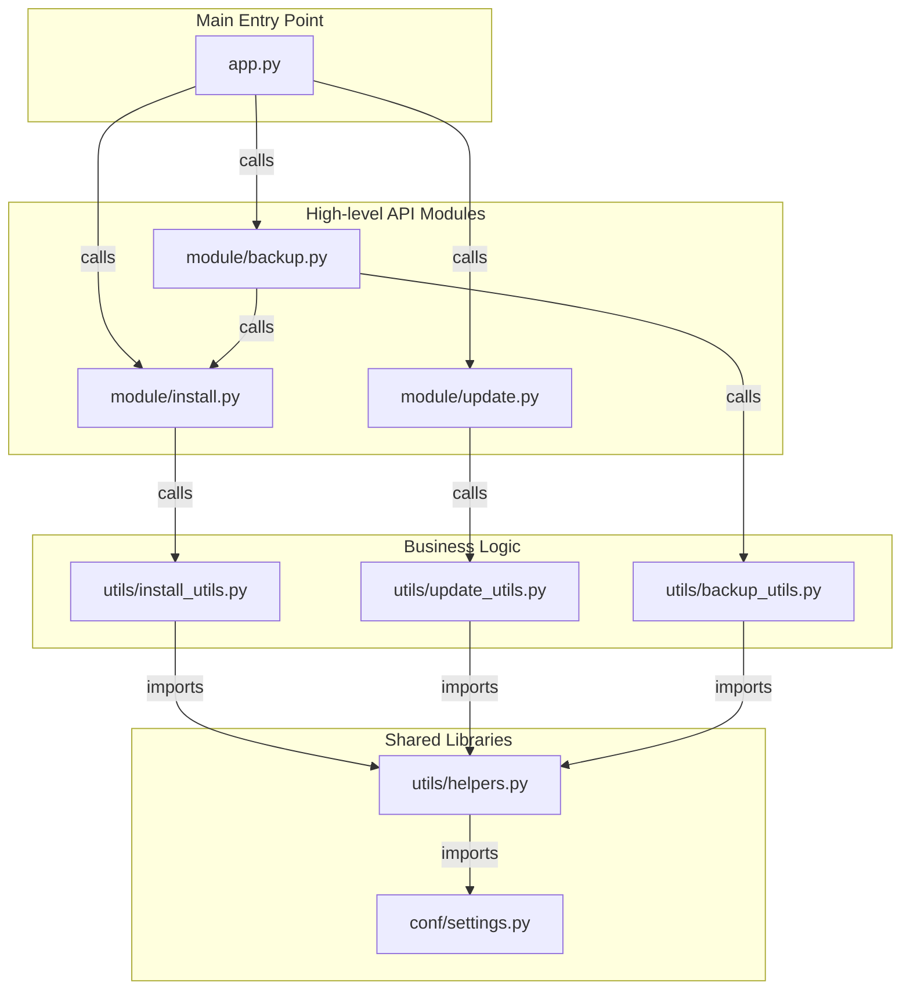

[以中文阅读](./develop.md)

# Developer Guide

This document outlines the project's internal structure and module relationships to aid in future development.

## Project Structure

The project is organized into the following main directories:

- `app.py`: The unified command-line entry point for the project, responsible for dispatching installation, update, and backup/recovery tasks.
- `module/`: Modules that encapsulate core features and can be called externally.
  - `install.py`: Provides the `install_agent` function.
  - `update.py`: Provides the `update_agent` function.
  - `backup.py`: Provides `backup_agent`, `recover_agent`, and `recover_and_install_agent` functions.
- `utils/`: Contains helper functions.
  - `helpers.py`: Low-level, shared utility functions (e.g., system commands, file operations).
  - `install_utils.py`: High-level functions for the installation process.
  - `update_utils.py`: High-level functions for the update process.
  - `backup_utils.py`: Low-level functions for backup/recovery (e.g., archiving, extraction, analysis).
- `conf/`: Contains static configuration files.
  - `settings.py`: Shared settings, such as remote repository URLs.

## Module Relationship Diagram

The following diagram illustrates how the different modules import and depend on each other.

