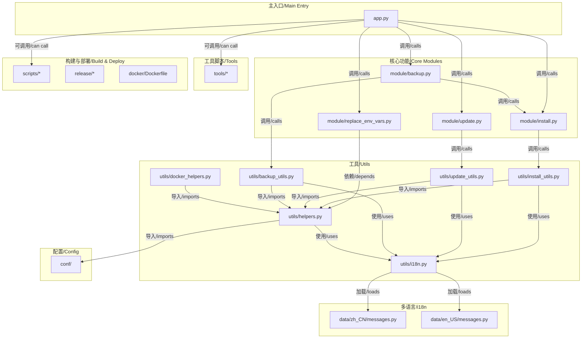

[Read this in English](./DEVELOP-EN.md)

# 开发者指南

本文档概述了项目的内部结构和模块关系，以帮助未来开发。

## 项目结构

项目被组织为以下主要目录和文件：

- `app.py`：项目统一命令行入口，调度安装、更新、备份恢复等任务。
- `module/`：核心功能模块（如 install、update、backup、replace_env_vars）。
- `utils/`：底层和高级工具函数（如 helpers、i18n、install_utils、update_utils、backup_utils、docker_helpers）。
- `conf/`：静态配置（如 backup_settings、docker_mirrors、i18n_settings、install_settings）。
- `data/`：多语言包（en_US、zh_CN）。
- `tools/`：实用工具脚本（如 Docker 镜像备份、导入、清理、权限设置）。
- `scripts/`：构建、依赖管理、消息排序等脚本。
- `release/`：NixOS 相关打包配置（nix、nixos 子目录）。
- `docker/`：Dockerfile 及相关容器配置。
- 其他：pyproject.toml、setup.py、requirements.txt 等元数据和依赖管理文件。

## 模块关系图

下图展示了不同模块之间的导入和依赖关系。



## 核心功能模块

### 运行环境检测

项目实现了智能的运行环境检测机制：

- `is_running_from_source()`: 检测是否从源码运行
- `get_command_prefix()`: 根据运行环境返回正确的命令前缀
- `get_version_info()`: 获取版本信息（源码 SHA 或包版本）

检测机制考虑多种因素：
- 命令名称检查（`nekro-agent-toolkit` vs `app.py`）
- 脚本路径分析（是否在安装目录中）
- 源码文件存在性检查
- 当前工作目录分析

### 跨平台备份系统

项目实现了跨平台的 Docker 卷备份解决方案：

#### Linux 系统策略
- 直接访问 Docker 卷的挂载点路径
- 使用标准文件系统操作进行备份和恢复

#### macOS/Windows 系统策略
- 通过 Docker 容器执行备份操作
- 使用 `docker run` 命令创建临时容器
- 在容器内执行 `tar` 命令操作卷数据

#### 智能卷管理
- 自动检测 Docker 卷是否存在
- 在新环境中自动创建缺失的卷
- 支持 `nekro_postgres_data` 和 `nekro_qdrant_data` 卷

#### 错误处理优化
- 区分 tar 命令的正常警告和真正错误
- 智能处理 "Removing leading `/' from member names" 警告
- 验证备份文件的完整性
- 智能过滤不必要的文件（logs、uploads、.env.example、._开头文件）

### 多语言支持系统

项目实现了完整的多语言支持系统：

#### 核心组件
- `utils/i18n.py`: 多语言管理模块
- `data/zh_CN/messages.py`: 中文语言包
- `data/en_US/messages.py`: 英文语言包

#### 功能特性
- 自动语言检测（基于 `$LANG` 环境变量）
- 动态语言切换支持
- 消息参数格式化
- 错误容错处理

#### 使用方法
```python
from utils.i18n import get_message as _

# 简单消息
print(_('checking_dependencies'))

# 带参数消息
print(_('error_directory_not_exist', '/path/to/dir'))
```

## 开发工作流程

### 添加新功能

1. **分析功能需求**：确定功能属于哪个模块层次
2. **设计接口**：在相应的模块中定义函数接口
3. **实现功能**：在 `utils/` 中实现底层逻辑
4. **集成测试**：确保跨平台兼容性
5. **更新文档**：更新用户文档和开发文档

### 跨平台开发最佳实践

1. **操作系统检测**：使用 `platform.system()` 检测系统类型
2. **路径处理**：使用 `os.path` 而非硬编码路径分隔符
3. **命令执行**：使用 `subprocess.run()` 并正确处理返回码
4. **错误处理**：区分系统相关错误和应用逻辑错误
5. **测试验证**：在多个操作系统上测试功能

### 备份系统扩展

如需添加新的 Docker 卷备份支持：

1. 在 `module/backup.py` 的 `DOCKER_VOLUMES_TO_BACKUP` 中添加卷名
2. 确保 `utils/backup_utils.py` 中的逻辑能处理新卷
3. 测试在不同操作系统上的备份和恢复功能

### 版本管理

项目支持两种版本信息：
- **开发版本**：基于 Git commit SHA
- **发布版本**：基于 setup.py/pyproject.toml 中的版本号

版本信息获取逻辑位于 `utils/helpers.py` 的 `get_version_info()` 函数。