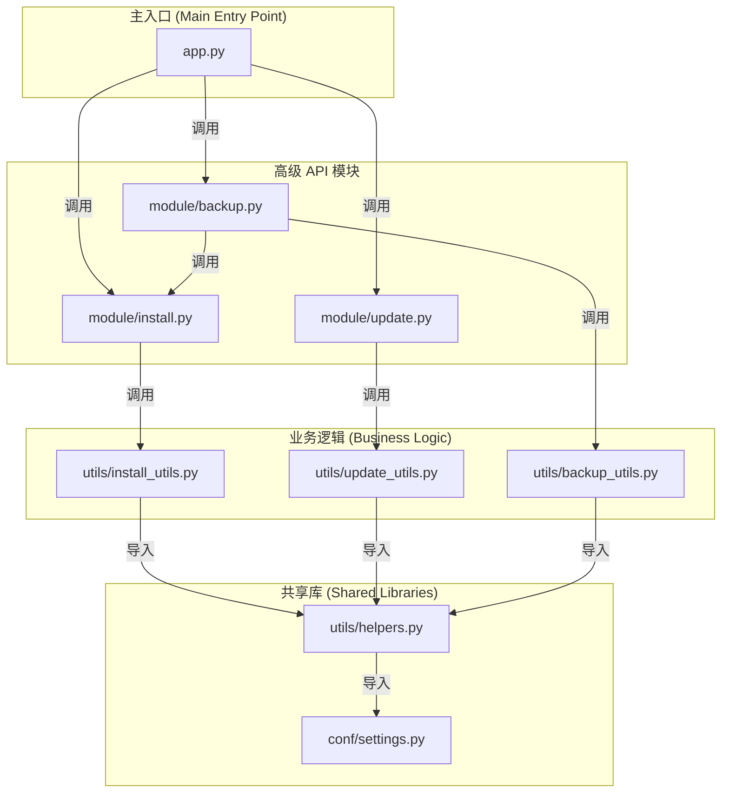

[Read this in English](./DEVELOP-EN.md)

# 开发者指南

本文档概述了项目的内部结构和模块关系，以帮助未来开发。

## 项目结构

项目被组织为以下几个主要目录：

- `app.py`: 项目的统一命令行入口，负责调度安装、更新和备份恢复任务。
- `module/`: 封装了核心功能的模块，可被外部调用。
  - `install.py`: 提供 `install_agent` 函数。
  - `update.py`: 提供 `update_agent` 函数。
  - `backup.py`: 提供 `backup_agent`、`recover_agent` 和 `recover_and_install_agent` 函数。
- `utils/`: 存放辅助函数。
  - `helpers.py`: 底层的、跨模块共享的工具函数（如系统命令、文件操作、运行环境检测、版本信息获取）。
  - `install_utils.py`: 服务于安装流程的高级函数。
  - `update_utils.py`: 服务于更新流程的高级函数。
  - `backup_utils.py`: 服务于备份恢复的底层函数（如打包、解压、分析归档、跨平台 Docker 卷操作）。
- `conf/`: 存放静态配置文件。
  - `settings.py`: 共享的配置，如远程仓库 URL。

## 模块关系图

下图展示了不同模块之间的导入和依赖关系。

## 核心功能模块

### 运行环境检测

项目实现了智能的运行环境检测机制：

- `is_running_from_source()`: 检测是否从源码运行
- `get_command_prefix()`: 根据运行环境返回正确的命令前缀
- `get_version_info()`: 获取版本信息（源码 SHA 或包版本）

检测机制考虑多种因素：
- 命令名称检查（`nekro-agent-toolkit` vs `app.py`）
- 脚本路径分析（是否在安装目录中）
- 源码文件存在性检查
- 当前工作目录分析

### 跨平台备份系统

项目实现了跨平台的 Docker 卷备份解决方案：

#### Linux 系统策略
- 直接访问 Docker 卷的挂载点路径
- 使用标准文件系统操作进行备份和恢复

#### macOS/Windows 系统策略
- 通过 Docker 容器执行备份操作
- 使用 `docker run` 命令创建临时容器
- 在容器内执行 `tar` 命令操作卷数据

#### 智能卷管理
- 自动检测 Docker 卷是否存在
- 在新环境中自动创建缺失的卷
- 支持 `nekro_postgres_data` 和 `nekro_qdrant_data` 卷

#### 错误处理优化
- 区分 tar 命令的正常警告和真正错误
- 智能处理 "Removing leading `/' from member names" 警告
- 验证备份文件的完整性

## 开发工作流程

### 添加新功能

1. **分析功能需求**：确定功能属于哪个模块层次
2. **设计接口**：在相应的模块中定义函数接口
3. **实现功能**：在 `utils/` 中实现底层逻辑
4. **集成测试**：确保跨平台兼容性
5. **更新文档**：更新用户文档和开发文档

### 跨平台开发最佳实践

1. **操作系统检测**：使用 `platform.system()` 检测系统类型
2. **路径处理**：使用 `os.path` 而非硬编码路径分隔符
3. **命令执行**：使用 `subprocess.run()` 并正确处理返回码
4. **错误处理**：区分系统相关错误和应用逻辑错误
5. **测试验证**：在多个操作系统上测试功能

### 备份系统扩展

如需添加新的 Docker 卷备份支持：

1. 在 `module/backup.py` 的 `DOCKER_VOLUMES_TO_BACKUP` 中添加卷名
2. 确保 `utils/backup_utils.py` 中的逻辑能处理新卷
3. 测试在不同操作系统上的备份和恢复功能

### 版本管理

项目支持两种版本信息：
- **开发版本**：基于 Git commit SHA
- **发布版本**：基于 setup.py/pyproject.toml 中的版本号

版本信息获取逻辑位于 `utils/helpers.py` 的 `get_version_info()` 函数。